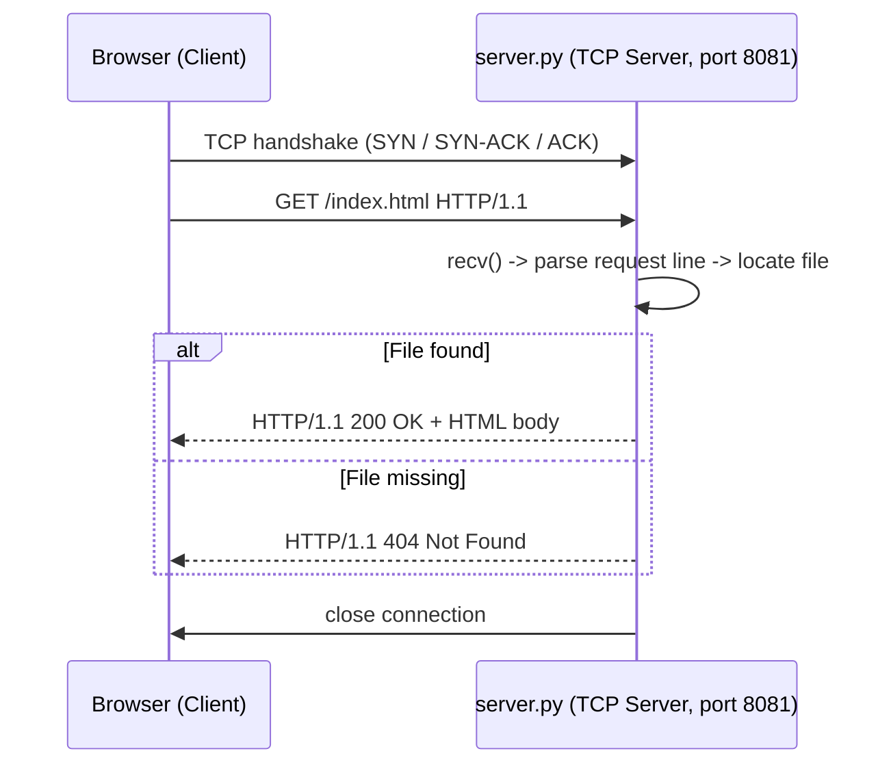
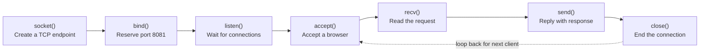

# Mini HTTP Web Server (Python Socket Programming)

A lightweight, single-threaded **HTTP/1.1 server built directly on TCP sockets** — no frameworks, no external libraries. It listens on a port, accepts connections from any standard web browser, parses the raw HTTP `GET` request, and serves a static HTML file back to it.

---

## Table of Contents

- [Overview](#overview)
- [How It Works](#how-it-works)
- [Why TCP, Not UDP](#why-tcp-not-udp)
- [Socket Lifecycle](#socket-lifecycle)
- [Project Structure](#project-structure)
- [Requirements](#requirements)
- [Getting Started](#getting-started)
- [Code Walkthrough](#code-walkthrough)
- [Testing](#testing)
- [Error Handling](#error-handling)
- [Possible Improvements](#possible-improvements)
- [Author](#author)

---

## Overview

This project bridges network theory with a real client-server application. The **browser is the HTTP client** — no custom client code is required — and `server.py` is the **TCP server**. When you open a URL like `http://localhost:8081/index.html`, the browser opens a raw TCP connection, sends a plain-text HTTP request over it, and the server parses that request, locates the file, and streams back a valid HTTP response.



## Why TCP, Not UDP

HTTP/1.1 requires a reliable, ordered byte stream — a single dropped or reordered packet would corrupt the HTML response before it ever reaches the browser. This is why the server binds a `SOCK_STREAM` (TCP) socket instead of `SOCK_DGRAM` (UDP).

| | **TCP — Chosen** | **UDP — Not Used** |
|---|---|---|
| Connection | Connection-oriented — reliable 3-way handshake before any data flows | Connectionless — no handshake |
| Delivery | Guarantees ordered, error-checked byte delivery | No delivery or ordering guarantee |
| Fit for HTTP | Matches HTTP/1.1's own requirement of a reliable stream | A lost/out-of-order packet could corrupt the response |
| Trade-off | Slightly more overhead per connection | Faster, lower overhead — better suited to video/gaming |
| In code | `socket.SOCK_STREAM` | Would require the app to rebuild reliability itself |

## Socket Lifecycle

Every stage below maps directly to one line in `server.py`:



| Stage | Code |
|---|---|
| Create socket | `socket.socket(socket.AF_INET, socket.SOCK_STREAM)` |
| Bind port | `server_socket.bind(("", 8081))` |
| Listen | `server_socket.listen(5)` |
| Accept | `server_socket.accept()` |
| Read request | `connection_socket.recv(1024).decode()` |
| Send response | `connection_socket.send(response)` |
| Close | `connection_socket.close()` |

## Project Structure

```
mini-http-server/
├── server.py       # TCP socket server (the HTTP server)
├── index.html      # Static page served to the browser
├── .gitignore
└── README.md
```

## Requirements

- Python 3.7+ (standard library only — no `pip install` needed)
- Any modern web browser

## Getting Started

```bash
# 1. Clone the repository
git clone https://github.com/cyber-mohanad/Mini_HTTP_Web_Server.git
cd Mini_HTTP_Web_Server

# 2. Run the server
python3 server.py
```

You should see:

```
Server is ready to receive on port 8081 ...
Open: http://localhost:8081/index.html
```

Then open your browser at:

```
http://localhost:8081/index.html
```

or simply `http://localhost:8081/` (the root path automatically serves `index.html`).

> To use a different port, edit the `PORT` constant at the top of `server.py`.

## Code Walkthrough

**1. Server setup — creating and preparing the socket**

```python
server_socket = socket.socket(socket.AF_INET, socket.SOCK_STREAM)
server_socket.bind((HOST, PORT))
server_socket.listen(BACKLOG)
```
- `AF_INET` → use IPv4 addressing.
- `SOCK_STREAM` → selects TCP instead of UDP.
- `bind(("", 8081))` → reserves port 8081 on every network interface of the machine.
- `listen(5)` → puts the socket into listening mode with a backlog queue for pending connections.

**2. Handling the request — accepting a connection and extracting the filename**

```python
connection_socket, address = server_socket.accept()
request = connection_socket.recv(1024).decode()
request_line = request.split("\r\n")[0]        # "GET /index.html HTTP/1.1"
method, path = request_line.split()[0], request_line.split()[1]
filename = DEFAULT_FILE if path == "/" else path.lstrip("/")
```
- `accept()` blocks until a browser connects, then returns a dedicated socket for that client.
- `recv(1024)` reads up to 1024 bytes of the raw HTTP request text.
- The request line is split by spaces to isolate the requested path, and the leading `/` is stripped so it can be used as a local filename.

**3. Building the response — success or failure**

```python
try:
    with open(filename, "r") as f:
        body = f.read()
    response = build_response("HTTP/1.1 200 OK", "text/html", body)
except FileNotFoundError:
    response = build_response("HTTP/1.1 404 Not Found", "text/plain", "404 - File Not Found")

connection_socket.send(response)
connection_socket.close()
```
Every response is sent back over the same socket the request arrived on, and the connection is explicitly closed afterward — the outer `while True` loop then keeps the server alive to accept the next browser connection.

## Testing

With the server running, try each of these from a terminal or a browser tab:

| Request | Expected Result |
|---|---|
| `http://localhost:8081/index.html` | `200 OK` — the page renders |
| `http://localhost:8081/` | `200 OK` — same page (root maps to `index.html`) |
| `http://localhost:8081/doesnotexist.html` | `404 Not Found` |

From the command line with `curl`:

```bash
curl -i http://localhost:8081/index.html
curl -i http://localhost:8081/doesnotexist.html
```

## Error Handling

- **Missing file** → caught with `except FileNotFoundError`, returns a clean `404 Not Found` instead of crashing.
- **Malformed request line** (missing method or path) → returns `400 Bad Request` rather than raising an unhandled exception.
- **Per-client isolation** → each connection is wrapped in `try/finally`, so the socket is always closed and one bad request can never take down the server loop.

## Possible Improvements

- [ ] Multi-threading (`threading` module) to serve multiple clients concurrently instead of one at a time
- [ ] Support for additional MIME types (CSS, JS, images) based on file extension
- [ ] Basic protection against path traversal (e.g. requests containing `../`)
- [ ] Persistent connections (`Connection: keep-alive`) instead of closing after every request

---
<div align="center">    
Built for learning & development.
</div>
<div align="center">    
All right reserved 2026©
</div>
